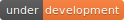

# Overview

This is a comparative analysis of various regression algorithms that can be used to predict stock prices.

Trying to predict the stock market is an enticing prospect to data scientists motivated not so much as a desire for material gain, but for the challenge. We see the daily ups and downs of the market and imagine there must be patterns we, or our models, can learn in order to beat all those day traders with business degrees.

Scikit Learn, TensorFlow and Keras were used to develop various regression models to predict stock prices. amCharts and Angular.js were used to plot the data and update the stock price charts. Optimized for desktop and mobile.

## Algorithms Analysed

* Linear Regression
* Bayesian Ridge Regression
* Ridge Regression
* Support Vector Machine
* ARIMA Regression
* LSTM Regression Model

## Data

Historical Stock Price Data is being accessed through [Quandl](https://www.quandl.com/) that offers a simple [API](https://docs.quandl.com/) for stock market data downloads. Their daily data feeds deliver end-of-day prices, historical stock fundamental data, harmonized fundamentals, financial ratios, indexes, options and volatility, earnings estimates, analyst ratings, investor sentiment etc.

## Demo 

- View demo at <https://stock-price-prediction.herokuapp.com/>

## Getting Started

In order to run a dev server on your local host, you will need to install the required python packages:

`pip install -r requirements.txt`

Now you can open up a terminal and start up a server for the backend on port 5000:

`set FLASK_APP=app.py`

`flask run`

Now you are all set up!

## Built With

* Python
* TensorFlow
* Keras
* Pandas
* Scikit Learn
* Flask
* Quandl
* Angular.js
* amCharts

## Authors

Prabhsimran Singh

## License

This project is licensed under the MIT License - see the LICENSE.md file for details